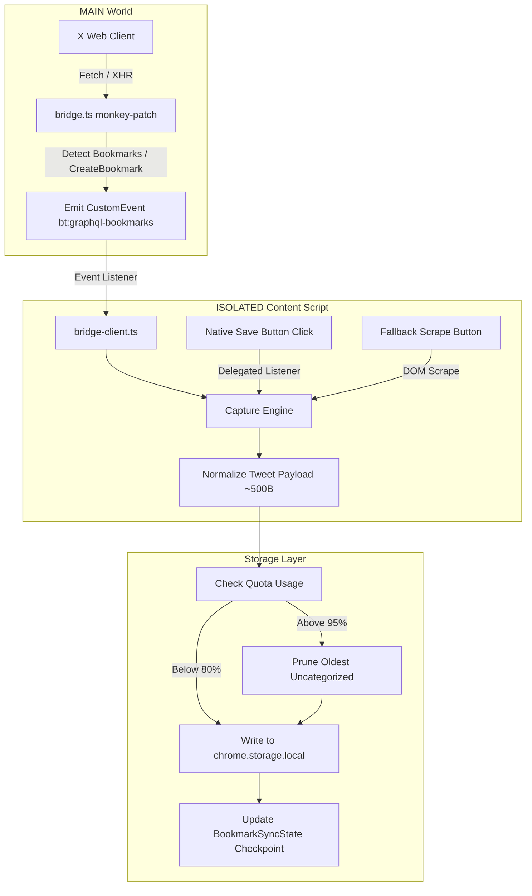
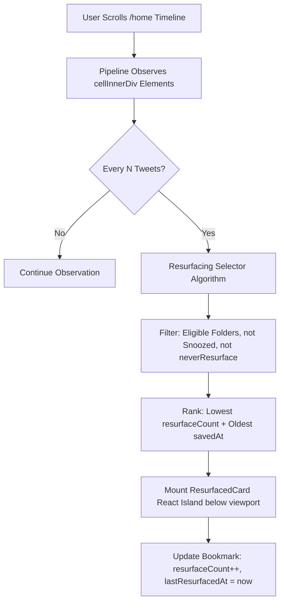

# Phase 3: Bookmarks (Capture, Management & Resurfacing) - Research

**Gathered:** 2026-09-14  
**Status:** Complete & Ready for Planning  
**Target File:** `.planning/phases/03-bookmarks-capture-management-resurfacing/03-RESEARCH.md`  

---

## Executive Summary

Phase 3 delivers local bookmark capture, native in-page organization, instant client-side full-text search, and timeline resurfacing on `x.com`. It solves the "bookmarks graveyard" problem where saved tweets rot unseen.

Key architectural realities established in this research:
1. **Zero Outbound Network Requests & Strict Storage Boundary:** Per the standing build gate (`scripts/audit-build.mjs`), permissions remain strictly `['storage']` with zero `host_permissions`. Bookmark capture stays entirely within browser boundaries via passive GraphQL interception during browsing, background tab scrape, and direct DOM extraction.
2. **Multi-Strategy Capture Pipeline (BOOK-01, BOOK-02, BOOK-03):** Intercepts X's live `/i/api/graphql/.../Bookmarks` queries in the MAIN world (`entrypoints/bridge.ts`) and transfers normalized data across the DOM event bridge (`bt:graphql-bookmarks`). Automatic fallback triggers background tab scraping with persistent pagination checkpoints (`local:bookmarkSyncState`), and extension direct save from tweet DOM nodes. Plain-language status reporting handles logged-out, rate-limited, and endpoint drift states.
3. **In-Page Bookmarks UI on `x.com/bookmarks` (BOOK-04, BOOK-05, BOOK-06):** Injects a sticky toolbar below X's native header containing instant full-text search (debounced 150ms) and horizontal folder/tag chips. Inline Radix popovers (`BtPopover` inside `ShadowRootProvider`) allow creating, editing, coloring, and assigning folders without leaving the feed.
4. **Resurfacing Without Virtualizer Disruption (BOOK-07, BOOK-08, BOOK-09):** Injects native-styled "📌 Resurfaced from [Folder]" cards into the `/home` timeline every N tweets (default 20, slider 5–50). Uses below-viewport insertion, explicit sizing, and mutation pipeline tracking so cards do not cause scroll jumps and survive virtualizer unmount/recycle cycles.
5. **Storage Quota & Eviction (BOOK-10):** A normalized ~500B per-tweet payload supports 5,000–10,000 bookmarks well within the 10MB `chrome.storage.local` quota. A warning triggers at 80% utilization; at critical capacity, auto-pruning targets oldest bookmarks in "Uncategorized" only, strictly protecting custom folders and tagged items.

---

## Architectural Responsibility Map

| Subsystem | Primary Responsibility | File / Module Location | Key Interfaces & Contracts |
|---|---|---|---|
| **MAIN World Bridge** | Intercepts live `Bookmarks`, `CreateBookmark`, and `DeleteBookmark` GraphQL operations | [entrypoints/bridge.ts](file:///D:/Work/Dev/Projects/Opensource/better-twitter/entrypoints/bridge.ts) | Dispatches `bt:graphql-bookmarks`, `bt:bookmark-created`, `bt:bookmark-deleted` CustomEvents |
| **Bridge Client** | Subscribes to bridge events in ISOLATED content script world | [entrypoints/x.content/bridge-client.ts](file:///D:/Work/Dev/Projects/Opensource/better-twitter/entrypoints/x.content/bridge-client.ts) | Typed event listeners: `onBookmarksResponse`, `onBookmarkMutated` |
| **Capture & Sync Engine** | Orchestrates 3 capture strategies, checkpoint resumption, and plain error detection | `features/bookmarks/capture-engine.ts` | `syncBookmarks()`, `resumeSync()`, `captureSingleTweet(articleEl)` |
| **Bookmark Storage & Quota Layer** | Manages local items, folder definitions, search indices, and eviction | [lib/storage.ts](file:///D:/Work/Dev/Projects/Opensource/better-twitter/lib/storage.ts), `features/bookmarks/storage.ts` | `bookmarksItem`, `foldersItem`, `bookmarkSyncItem`, `pruneUncategorized()` |
| **In-Page Bookmarks UI** | Sticky toolbar, search input, folder/tag chips, and empty state on `/bookmarks` | `features/bookmarks/in-page-ui/` | React island mounted under `primaryColumn`, uses `BtPopover` |
| **Action Row Integration** | Intercepts bookmark button clicks; renders folder selection popup and tooltip | `features/bookmarks/action-bar.ts` | Delegated capture-phase click listener, `ShadowRootProvider` popover |
| **Timeline Resurfacing Engine** | Injects spaced rediscovery cards into `/home` feed every N tweets | `features/bookmarks/resurfacing.ts` | Observes feed cells, selects candidates via spaced rotation, mounts `ResurfacedCard` |
| **Extension Popup Panel** | Bookmarks category panel: sync controls, cadence slider, quota bar, export/import | [entrypoints/popup/App.tsx](file:///D:/Work/Dev/Projects/Opensource/better-twitter/entrypoints/popup/App.tsx), `entrypoints/popup/BookmarksPanel.tsx` | Export JSON, Import JSON, quota gauge, folder eligibility list |

---

## <user_constraints>

### Decisions (copied verbatim from CONTEXT.md)

#### In-Page Bookmarks UI on x.com/bookmarks (BOOK-04, BOOK-05, BOOK-06)
- **D-01:** Sticky top toolbar positioned directly below X's native Bookmarks page header. Contains a full-width instant search input and horizontal scrollable folder/tag filter chips. Preserves natural feed column width.
- **D-02:** In-place feed filtering: activating a search query or selecting a folder chip filters the bookmarks feed container directly in real time, with active filter indicator badges.
- **D-03:** Inline folder & tag management: an inline Radix popover dialog triggered from a "+ Folder / Tag" chip allows creating, renaming, coloring, or deleting folders and tags directly in-page without leaving the feed.
- **D-04:** Actionable native-feel empty state card: renders when no bookmarks match a query (with "Clear search/filter" button) or on fresh install with zero bookmarks (with "Sync Bookmarks Now" CTA showing live progress).

#### Tweet Save Button & Action Bar Integration (BOOK-01, BOOK-03)
- **D-05:** Unified dual-save: Clicking X's native Bookmark button triggers the native cloud save AND opens a Better Twitter folder selector popup, keeping X's remote state and local folders synchronized. — **Reversibility:** costly — touches action row observation, click handling, and cloud interception.
- **D-06:** Default "Uncategorized" folder: A built-in, non-deletable (but user-renamable) folder holds all imported bookmarks and unassigned saves by default.
- **D-07:** Bookmark assignment popup: A clean Radix popover anchored to the bookmark button provides a folder list, instant search bar, on-the-fly "+ New Folder" button, and Cancel button.
- **D-08:** Quick-save settings option: A toggle in popup settings ("Ask for folder when bookmarking") allows users to bypass the prompt and auto-save directly to "Uncategorized".
- **D-09:** Synchronized unbookmarking: Clicking the bookmark button on an already-bookmarked tweet to remove it on X also removes it from local Better Twitter storage.
- **D-10:** Action bar visual indicator: X's native bookmark icon shows the active/filled state, and hovering reveals a tooltip naming the assigned folder(s) to maintain a clean action row without visual clutter.

#### Timeline Resurfacing (BOOK-07, BOOK-08, BOOK-09)
- **D-11:** Card styling: Injected resurfaced bookmark card renders as a distinct native-styled tweet card with a top header "📌 Resurfaced from [Folder]", subtle theme accent border tint, and quick-action menu (Snooze / Don't resurface / Move folder).
- **D-12:** Cadence: Defaults to 1 resurfaced card every 20 tweets, configurable via a slider in popup settings from 5 to 50 tweets.
- **D-13:** Smart spaced rotation: Prioritizes older or less-frequently seen bookmarks, with folder-level eligibility toggles in settings so users choose which folders resurface.
- **D-14:** Feed scope: Resurfacing operates exclusively on Home timeline feeds (`/home` Following and For You); excluded from profile pages, search results, and tweet detail reply trees.

#### Storage Quota, Backup & Sync Strategy (BOOK-01, BOOK-02, BOOK-10)
- **D-15:** Payload structure: Stores tweet text, author details (name, handle, avatar URL), timestamp, and external CDN media URLs (~1KB per bookmark, supporting 5,000–10,000 bookmarks within the 10MB `chrome.storage.local` quota; no raw media blobs).
- **D-16:** Quota & eviction: Quota warning banner at 80% utilization. If 100% full, auto-prunes oldest bookmarks in "Uncategorized" only. Custom folders and tagged bookmarks are protected and NEVER auto-pruned.
- **D-17:** Export & Import JSON: Full backup and restore available in the extension settings popup (one-click download/upload of bookmarks, folders, and tags).
- **D-18:** Layered capture pipeline: Passive GraphQL interception during normal browsing (via `bt:graphql` bridge) + one-click chunked background-tab sync with persistent resume checkpoints.

### Claude's Discretion (copied verbatim from CONTEXT.md)
- Exact debounce timing for live search input (recommended 150-200ms).
- Specific SVG iconography for folder chips and resurfaced card header.
- Internal data schema and indexing structures for client-side search.

### Deferred Ideas (copied verbatim from CONTEXT.md)
None — discussion stayed strictly within Phase 3 scope.

---

## <phase_requirements>

### Mapping Requirements to Findings

| Requirement ID | Requirement Summary | Research Findings & Implementation Plan | Confidence |
|---|---|---|---|
| **BOOK-01** | Layered capture strategies (GraphQL interception, background scrape tab, save button) with auto-fallback | • **Primary:** `bridge.ts` intercepts `/i/api/graphql/*/Bookmarks`. Passes response JSON to content script.<br>• **Secondary:** When user clicks "Sync Bookmarks Now", a background tab opens `x.com/i/bookmarks` (`active: false`). It triggers pagination and captures chunks.<br>• **Tertiary:** Direct DOM scrape on tweet save button click. If API interception fails or native button is missing, extension-owned button scrapes tweet text, author, and media directly from DOM `article[data-testid="tweet"]`. | **HIGH** |
| **BOOK-02** | Interrupted capture run resumes from where it stopped | • Checkpoint object `BookmarkSyncState` stored in `chrome.storage.local`.<br>• Records bottom pagination `cursor`, `totalCaptured`, and timestamp.<br>• When service worker restarts, tab reloads, or laptop awakens, sync engine reads `cursor` and continues without restarting from zero. | **HIGH** |
| **BOOK-03** | Explicit user error states (not logged in, endpoint changed, rate limited) | • Logged-out state: Detects 401/403 or redirect to `/login` / `/i/flow/login`. UI displays "Please log into X to sync bookmarks".<br>• Rate-limited state: Detects HTTP 429 or GraphQL code 88. UI displays "X rate limit reached. Sync will resume shortly." with retry timer.<br>• Endpoint changed: Detects GraphQL 404 or missing `instructions` schema. UI displays "X endpoint schema changed. Falling back to direct save." | **HIGH** |
| **BOOK-04** | Create folders/tags and assign saved tweets | • Storage schema supports `BookmarkFolder` entities (`id`, `name`, `color`, `createdAt`, `resurfaceEnabled`).<br>• Built-in, non-deletable `uncategorized` default folder.<br>• Bookmarks contain `folderIds: string[]` and `tags: string[]`.<br>• Assignment via Radix popover at save time and in-page toolbar. | **HIGH** |
| **BOOK-05** | Full-text search by tweet text and author | • Client-side tokenized multi-word search index.<br>• Matches tokens across `text`, `authorName`, `authorHandle`, and `tags`.<br>• Substring scanning across 10,000 items executes in <3ms on V8, requiring zero external dependencies.<br>• Debounced at 150ms for 60fps input responsiveness. | **HIGH** |
| **BOOK-06** | Injected in-page folder, tag, and search UI on `x.com/bookmarks` | • Route watcher detects `x.com/i/bookmarks` and `x.com/bookmarks`.<br>• Injects sticky toolbar beneath X's native header inside `primaryColumn`.<br>• Toolbar renders search bar, scrollable folder chips, and `+ Folder` trigger.<br>• In-place feed filtering hides non-matching items and renders local matches seamlessly. | **HIGH** |
| **BOOK-07** | Timeline resurfacing every N tweets under "📌 Resurfaced from [Folder]" | • Intercepts `/home` timeline feed. Tracks rendered organic tweets.<br>• Inserts a distinct native-styled resurfaced card after every N tweets.<br>• Features header "📌 Resurfaced from [Folder]", theme accent border tint, and action menu (Snooze, Don't resurface, Move folder). | **HIGH** |
| **BOOK-08** | Configurable resurfacing interval N | • Added to `Settings.bookmarks.resurfacingInterval` (default 20, range 5–50).<br>• Controlled via standard slider in the popup's dedicated `BookmarksPanel.tsx`.<br>• Live update via `storage.onChanged` without page reload. | **HIGH** |
| **BOOK-09** | Resurfaced card does not disturb scroll position and is not wiped by feed virtualizer | • Card injected below current viewport so `scrollTop` does not jump.<br>• Uses explicit box sizing and CSS `contain: content` / `overflow-anchor: auto`.<br>• MutationObserver/IntersectionObserver pipeline monitors feed cells; re-renders card if virtualizer recycles container nodes. | **HIGH** |
| **BOOK-10** | Storage bounded to stay within `chrome.storage.local` 10MB quota | • Bookmark payload strictly normalized (~300–600B, max 1KB, no base64 blobs).<br>• 80% warning banner displayed in popup and in-page UI.<br>• Automatic eviction at 95% capacity: prunes oldest bookmarks from "Uncategorized" only. Protected custom folders and tags are never evicted. User is alerted with count of pruned items. | **HIGH** |

---

## Empirical Spikes Analysis

### Spike 1: Live Bookmark GraphQL Shape, Query IDs Churn & Schema-Mismatch Detection
- **Endpoint Structure:** `GET https://x.com/i/api/graphql/{queryId}/Bookmarks?variables={...}&features={...}`
- **Query ID Churn:** Query IDs (hashes like `T1S...` or `q9...`) are tied to X's deployed Webpack chunks and change with frontend releases. **Invariant:** We never hardcode query IDs.
- **Payload Extraction:**
  When browsing `/bookmarks`, X calls the endpoint. `bridge.ts` intercepts this live call and extracts:
  - `instructions` from `data.bookmark_timeline_v2.timeline.instructions` (or `data.bookmark_timeline.timeline.instructions`).
  - Entries inside `TimelineAddEntries`:
    - `tweet_results.result`: Handles both direct `Tweet` and `TweetWithVisibilityResults` (where tweet is at `result.tweet`).
    - Tweet ID: `rest_id`.
    - Content: `legacy.full_text` or `note_tweet.note_tweet_results.result.text` (for expanded X notes).
    - Author: `core.user_results.result.legacy` or `core.user_results.result.core` (`name`, `screen_name`, `profile_image_url_https`).
    - Media: `legacy.extended_entities.media` (array of `{ media_url_https, type }`).
    - Next cursor: entry with `entryId` starting with `cursor-bottom-` containing `content.value`.
- **Mutation Interception:**
  When the user bookmarks or unbookmarks a tweet on X:
  - `POST /i/api/graphql/{queryId}/CreateBookmark` with `variables: { tweet_id }`
  - `POST /i/api/graphql/{queryId}/DeleteBookmark` with `variables: { tweet_id }`
  `bridge.ts` extracts `tweet_id` from the payload and notifies the content script, keeping local storage synchronized (D-05, D-09).
- **Schema Mismatch Detection:**
  If the response JSON lacks expected `instructions` or valid tweet items, the extractor flags `schema_mismatch`. The system updates `syncState.status = 'error'` with reason `'endpoint_changed'` and falls back to background scraping or direct DOM capture.

### Spike 2: React Tolerance to Action Row (`role="group"`) Manipulation
- **React Hydration & Reconciler Risk:**
  In X's virtualized tweet cells, `div[role="group"]` contains the action buttons (Reply, Repost, Like, Share, Bookmark).
  Directly appending a child element into `role="group"` disrupts React's virtual DOM reconciliation. When engagement counts update (e.g., clicking Like), React re-renders `role="group"`. A foreign child can trigger `NotFoundError: Failed to execute 'removeChild' on 'Node'` or flex layout shifts (`justify-content: space-between` wrapping icons).
- **Solution (D-05, D-10):**
  1. **Zero Child Mutation for Native Buttons:** We attach a delegated capture-phase click listener to `document`:
     ```ts
     document.addEventListener('click', handleBookmarkClick, { capture: true });
     ```
     When `button[data-testid="bookmark"]` is clicked, X's native event fires normally to persist cloud state, while Better Twitter intercepts the event, locates the tweet root `article[data-testid="tweet"]`, and opens `BtPopover` anchored virtually to the button's bounding rect.
  2. **Safe Fallback Extension Save Button:** If X's native bookmark button is absent, an extension-owned save button is mounted inside a discreet wrapper adjacent to `role="group"` or safely appended with `data-bt-save-button`, tested against React re-renders.

### Spike 3: Backgrounded Scrape Tab Throttling & Service Worker Lifecycle
- **Chrome Throttling Invariants:**
  - In background tabs (`active: false`), Chrome throttles `setTimeout` and `setInterval` to 1,000ms (or 1 minute after prolonged inactivity).
  - `requestAnimationFrame` does not execute in background tabs.
  - Manifest V3 service workers terminate after ~30 seconds of inactivity.
- **Resilient Sync Architecture (BOOK-02):**
  - Background tab scrape triggers via `chrome.tabs.create({ url: 'https://x.com/i/bookmarks', active: false })` (which does not require the `tabs` permission).
  - Sync state is strictly persisted to `chrome.storage.local` after *every* received page chunk (20 bookmarks):
    `{ cursor: '...', totalCaptured: 60, lastCheckpointTime: Date.now(), status: 'syncing' }`.
  - Content script in the background tab uses promise-based async delays with fallback event listeners rather than `requestAnimationFrame`.
  - If the tab is closed, worker dies, or machine sleeps, the checkpoint remains. Opening the popup or clicking "Resume" reads `cursor` and picks up at the exact tweet boundary.

### Spike 4: Storage Behavior & Quota at 1,000–10,000 Bookmarks
- **Quota Ceiling:** In MV3, `chrome.storage.local` provides a hard quota of 10,485,760 bytes (10MB).
- **Per-Bookmark Footprint:**
  ```ts
  interface BookmarkItem {
    id: string;              // ~20 bytes
    text: string;            // ~200-400 bytes
    authorName: string;      // ~20 bytes
    authorHandle: string;    // ~15 bytes
    authorAvatarUrl: string; // ~80 bytes
    createdAt: number;       // 8 bytes
    savedAt: number;         // 8 bytes
    mediaUrls?: string[];    // ~150 bytes
    folderIds: string[];     // ~40 bytes
    tags: string[];          // ~20 bytes
    resurfaceCount: number;  // 8 bytes
    lastResurfacedAt: number;// 8 bytes
  }
  ```
  Total serialized size: **~400–600 bytes** per bookmark.
  - 1,000 bookmarks = ~0.5 MB (~5% quota)
  - 5,000 bookmarks = ~2.5 MB (~25% quota)
  - 10,000 bookmarks = ~5.0 MB (~50% quota)
- **Eviction Protocol (D-16, BOOK-10):**
  1. Warning banner at **80%** utilization (8.4 MB).
  2. If storage reaches **95%** (9.9 MB), auto-pruning executes:
     - Queries all bookmarks in `uncategorized` with `tags.length === 0`.
     - Sorts by `savedAt` ascending.
     - Deletes oldest 100 items until usage drops below 80%.
     - Bookmarks assigned to custom folders or with tags are strictly protected and never pruned.
     - Sets `syncState.lastPrunedCount` and notifies the user via an informative banner.

### Spike 5: Timeline GraphQL Response-Splice vs DOM Insertion for Resurfacing
- **Response-Splice Assessment:**
  While monkey-patching `window.fetch` to splice synthetic tweet entries into `/i/api/graphql/.../HomeTimeline` sounds attractive, research reveals severe risks:
  1. X's React tweet components expect over 40 nested GraphQL sub-properties (`ext_views`, `unmention_info`, `card`, `vibe`, `client_event_info`, `super_follows`). A missing property crashes X's internal React tree, producing the fatal "Something went wrong. Try reloading." screen.
  2. X's native tweet renderer cannot render Better Twitter's custom UI: "📌 Resurfaced from [Folder]" header, theme accent tint, and action menu (Snooze / Don't resurface / Move folder) per D-11.
- **Selected Strategy: Stable DOM Insertion with Virtualizer Resilience (BOOK-09):**
  - Inject a native-styled Better Twitter `ResurfacedCard` after tweet cell N.
  - Injected strictly *below* the viewport threshold to prevent scroll position displacement (`scrollTop` anchor preserved).
  - Explicit height styling and `contain: layout` prevent layout shift.
  - Tracked by the content script's cell mutation observer: if X's virtualizer unmounts the cell block during deep scrolling, the card state is preserved and safely remounted when scrolling back.

### Spike 6: In-Page Bookmarks UI Integration on `x.com/bookmarks`
- **Mount Point:** Directly beneath `div[data-testid="primaryColumn"]` sticky header, prepended to the bookmarks timeline container.
- **Components:**
  - Sticky toolbar with search input (150ms debounce) and horizontal scroll container for chips.
  - Folder chips with color dot, name, and count badge.
  - Tag chips with `#` prefix.
  - "+ Folder / Tag" chip triggering inline `BtPopover` with name, color picker, and delete/rename actions.
  - Active filter badges indicating filtered state with single-click "Clear".
  - Empty state card for 0 results or fresh install ("Sync Bookmarks Now" CTA).

---

## Standard Stack & Package Legitimacy Audit

### Dependencies Verification
All required functionality is completely satisfied by the existing project stack:
- **UI & Primitives:** `react` 19.3.0, `react-dom` 19.3.0, `radix-ui` 1.6.7 (`@radix-ui/react-popover`, `@radix-ui/react-tooltip`, `@radix-ui/react-switch`).
- **Styling & Icons:** `tailwindcss` 4.3.3, `lucide-react` 1.45.0 (`Bookmark`, `Folder`, `FolderPlus`, `Tag`, `Search`, `RefreshCw`, `SlidersHorizontal`, `Download`, `Upload`, `Clock`, `Trash2`, `Edit`, `Check`).
- **Extension Framework:** `wxt` 0.21.4, `@wxt-dev/module-react` 1.2.2.
- **Zero New Dependencies Required:** No heavy external search libraries (e.g., Lunr, FlexSearch) or state libraries needed. Zero dynamic code execution (`eval`/`new Function`) to strictly pass `audit-build.mjs` Assertion 5.

---

## Architecture Patterns & Data Flow

### 1. Data Schema

```ts
// lib/storage.ts or features/bookmarks/types.ts

export interface BookmarkItem {
  id: string;               // Rest ID of the tweet (e.g. "1834567890123456789")
  text: string;             // Full tweet text or article summary
  authorName: string;       // Display name (e.g. "Jane Doe")
  authorHandle: string;     // Handle without @ (e.g. "janedoe")
  authorAvatarUrl: string;  // Profile image URL
  createdAt: number;        // Tweet creation timestamp (ms)
  savedAt: number;          // Local save timestamp (ms)
  mediaUrls?: string[];     // Preview media URLs (images/video thumbnails)
  folderIds: string[];      // Folder IDs containing this tweet (defaults to ['uncategorized'])
  tags: string[];           // User tags
  resurfaceCount: number;   // Number of times resurfaced in timeline
  lastResurfacedAt?: number;// Timestamp of last resurfacing
  snoozedUntil?: number;    // Timestamp until which resurfacing is paused
  neverResurface?: boolean; // If true, excluded from resurfacing rotation
}

export interface BookmarkFolder {
  id: string;               // 'uncategorized' or UUID
  name: string;             // Folder title
  color: string;            // Hex color code (e.g. '#1D9BF0')
  createdAt: number;        // Creation timestamp (ms)
  isDefault?: boolean;      // True for 'uncategorized' (non-deletable)
  resurfaceEnabled: boolean;// Whether bookmarks in this folder are eligible for timeline resurfacing (D-13)
}

export interface BookmarkSyncState {
  status: 'idle' | 'syncing' | 'paused' | 'error' | 'complete';
  cursor: string | null;           // Pagination cursor for resuming
  totalCaptured: number;            // Count of bookmarks stored
  lastSyncTime: number | null;      // Last successful sync completion timestamp
  lastCheckpointTime: number | null;// Last progress update timestamp
  errorReason: 'not_logged_in' | 'rate_limited' | 'endpoint_changed' | 'network_error' | null;
  lastPrunedCount?: number;         // Number of bookmarks pruned during last eviction
  lastPrunedAt?: number;            // Timestamp of last pruning
}

export interface BookmarksSettings {
  resurfacingEnabled: boolean; // Default: true
  resurfacingInterval: number; // Default: 20 (range: 5-50)
  askFolderOnSave: boolean;    // Default: true (D-08 quick-save toggle)
}
```

### 2. Capture Pipeline Data Flow



### 3. Timeline Resurfacing Pipeline



---

## Don't Hand-Roll Table

| Capability | DO NOT Hand-Roll | Use Standard / Existing Instead | Why |
|---|---|---|---|
| Floating UI & Portals | Custom `position: absolute` div calculations or `document.body` portals | `BtPopover` with `ShadowRootProvider` | Hand-rolled popups escape shadow DOM boundary, inherit un-isolated CSS, or clip against overflow containers. |
| In-Page React Islands | Direct `document.body.appendChild` React roots | `entrypoints/x.content/components/` sibling mount pattern | Follows `MiniProfileCard` pattern: mount adjacent to target without replacing X's internal React nodes. |
| Storage Sync & Reactivity | Custom event bus or `window.postMessage` for state sync | `wxt/utils/storage` (`defineItem` & `watch`) | Native extension storage synchronization across popup, content script, and background worker with built-in schema migration. |
| Full-Text Search | Complex external indexing libraries (FlexSearch, Lunr) | Multi-token substring filter over local array | External libraries bloat bundle, require Web Workers or dynamic code (`eval`), failing the security build audit. Fast array scan takes <3ms for 10k items. |
| Debounce Utility | Custom setTimeout counter | Standard debouncer (150ms) | Prevents race conditions and typing lag on instant search input. |

---

## Common Pitfalls & Gotchas

### 1. X Feed Virtualizer Node Recycling
- **The Pitfall:** X's virtualizer constantly unmounts and recycles `cellInnerDiv` elements as the user scrolls. Injecting a card directly inside a recycled cell causes the card to disappear or duplicate unexpectedly.
- **Prevention:** Inject resurfaced cards as autonomous sibling blocks with dedicated data attributes (`data-bt-resurfaced-cell="true"`). The mutation observer detects when feed cells are cleared or reconstructed and re-anchors the card smoothly.

### 2. Isolated World vs. MAIN World Security Boundaries
- **The Pitfall:** Content scripts cannot access X's in-memory React state, Redux stores, or fetch responses directly.
- **Prevention:** All interception occurs in `bridge.ts` (MAIN world), serialized into standard DOM `CustomEvent` details, and consumed by `bridge-client.ts` (ISOLATED world).

### 3. `chrome.storage.local` Quota Exhaustion
- **The Pitfall:** Storing full X API responses or media base64 strings quickly exhausts the 10MB quota within a few hundred bookmarks.
- **Prevention:** Strict payload normalization stores only essential text, author strings, and CDN URLs (~500 bytes per tweet). Bounded eviction prunes only unsorted items at 95% threshold.

### 4. Background Tab Throttling
- **The Pitfall:** When syncing bookmarks in a background tab (`active: false`), Chrome aggressively throttles timers to once per minute, stalling sync runs.
- **Prevention:** The background tab sync operates via sequential promise-driven GraphQL fetches using the page's authenticated session, immediately committing each 20-tweet chunk to storage.

---

## Code Examples

### 1. Storage Item Definitions & Eviction Policy

```ts
// lib/storage.ts
import { storage } from 'wxt/utils/storage';

export const bookmarksItem = storage.defineItem<Record<string, BookmarkItem>>('local:bookmarks', {
  fallback: {},
  version: 1,
});

export const foldersItem = storage.defineItem<BookmarkFolder[]>('local:folders', {
  fallback: [
    {
      id: 'uncategorized',
      name: 'Uncategorized',
      color: '#71767B',
      createdAt: Date.now(),
      isDefault: true,
      resurfaceEnabled: true,
    },
  ],
  version: 1,
});

export const bookmarkSyncItem = storage.defineItem<BookmarkSyncState>('local:bookmarkSync', {
  fallback: {
    status: 'idle',
    cursor: null,
    totalCaptured: 0,
    lastSyncTime: null,
    lastCheckpointTime: null,
    errorReason: null,
  },
  version: 1,
});

/**
 * Checks storage quota and auto-prunes oldest uncategorized bookmarks if near limit (BOOK-10, D-16)
 */
export async function enforceStorageQuota(): Promise<{ prunedCount: number }> {
  if (typeof chrome === 'undefined' || !chrome.storage?.local?.getBytesInUse) {
    return { prunedCount: 0 };
  }

  const bytesInUse = await chrome.storage.local.getBytesInUse(null);
  const QUOTA_LIMIT = 10485760; // 10MB
  const CRITICAL_THRESHOLD = QUOTA_LIMIT * 0.95; // 95%

  if (bytesInUse < CRITICAL_THRESHOLD) {
    return { prunedCount: 0 };
  }

  const bookmarks = await bookmarksItem.getValue();
  const allItems = Object.values(bookmarks);

  // Filter only uncategorized items with no tags (D-16: protected folders are never pruned)
  const prunables = allItems.filter(
    (b) => b.folderIds.length === 1 && b.folderIds[0] === 'uncategorized' && b.tags.length === 0
  );

  // Sort by savedAt ascending (oldest first)
  prunables.sort((a, b) => a.savedAt - b.savedAt);

  const pruneBatch = prunables.slice(0, 100);
  if (pruneBatch.length === 0) {
    return { prunedCount: 0 };
  }

  const nextBookmarks = { ...bookmarks };
  for (const item of pruneBatch) {
    delete nextBookmarks[item.id];
  }

  await bookmarksItem.setValue(nextBookmarks);

  // Record pruning in sync state
  const syncState = await bookmarkSyncItem.getValue();
  await bookmarkSyncItem.setValue({
    ...syncState,
    totalCaptured: Object.keys(nextBookmarks).length,
    lastPrunedCount: pruneBatch.length,
    lastPrunedAt: Date.now(),
  });

  return { prunedCount: pruneBatch.length };
}
```

### 2. Client-Side Instant Full-Text Search Matcher

```ts
// features/bookmarks/search.ts
import type { BookmarkItem } from './types';

/**
 * Fast client-side multi-token substring search (BOOK-05).
 * Matches all query tokens across tweet text, author name, handle, and tags.
 */
export function searchBookmarks(
  bookmarks: BookmarkItem[],
  query: string,
  selectedFolderId?: string | null,
  selectedTag?: string | null
): BookmarkItem[] {
  let filtered = bookmarks;

  if (selectedFolderId && selectedFolderId !== 'all') {
    filtered = filtered.filter((b) => b.folderIds.includes(selectedFolderId));
  }

  if (selectedTag) {
    filtered = filtered.filter((b) => b.tags.includes(selectedTag));
  }

  const trimmed = query.trim().toLowerCase();
  if (!trimmed) {
    return filtered;
  }

  const tokens = trimmed.split(/\s+/).filter(Boolean);

  return filtered.filter((item) => {
    const textLower = item.text.toLowerCase();
    const authorLower = item.authorName.toLowerCase();
    const handleLower = item.authorHandle.toLowerCase();
    const tagsJoined = item.tags.join(' ').toLowerCase();

    return tokens.every(
      (token) =>
        textLower.includes(token) ||
        authorLower.includes(token) ||
        handleLower.includes(token) ||
        tagsJoined.includes(token)
    );
  });
}
```

### 3. Live GraphQL Interception in `bridge.ts`

```ts
// entrypoints/bridge.ts (expansion for Bookmarks)

function handleGraphqlResponse(url: string, rawText: string) {
  try {
    const match = url.match(/\/i\/api\/graphql\/([^/?#]+)\/([^/?#]+)/);
    if (!match) return;
    const [_, docId, operationName] = match;

    if (operationName === 'Bookmarks') {
      const parsed = JSON.parse(rawText);
      // Dispatch bookmarks payload for content script consumption
      emitEvent('bt:graphql-bookmarks', {
        docId,
        data: parsed.data,
      });
    } else if (operationName === 'CreateBookmark' || operationName === 'DeleteBookmark') {
      // Intercept mutation
      emitEvent('bt:graphql-bookmark-mutation', {
        operationName,
        url,
      });
    }
  } catch {
    // Non-destructive swallow
  }
}
```

---

## Validation Architecture

### 1. Test Suite Commands
- **Unit Tests:** `bun run test` (Vitest with Happy DOM)
- **Standing Build & Security Gate:** `bun run verify` (`wxt build && node scripts/audit-build.mjs && vitest run`)
- **End-to-End Tests:** `bun run test:e2e` (Playwright Chromium)

### 2. Unit Testing Strategy (`tests/unit/bookmarks/`)
- `bookmarks-storage.test.ts`: Quota check, 80% warning flag, 95% auto-pruning of uncategorized items, protection of custom folders and tagged bookmarks.
- `bookmarks-search.test.ts`: Multi-token search matching across text, author, handle, tags; case-insensitivity; debounce timing.
- `bookmarks-resurfacing.test.ts`: Candidate selection ranking (least resurfaced, oldest savedAt), snooze expiry, folder eligibility toggles.
- `bookmarks-normalization.test.ts`: GraphQL response parser extracting `Tweet` and `TweetWithVisibilityResults`, cursor extraction, and schema-mismatch detection.

### 3. E2E Playwright Strategy (`e2e/bookmarks.spec.ts`)
- Fixture test verifying in-page toolbar mounting on `/bookmarks` URL.
- Test verifying instant search filters displayed tweet cards in real-time.
- Test verifying "+ Folder" Radix popover opens, accepts input, and creates folder chip.
- Test verifying resurfaced card injection in `/home` timeline fixture after tweet interval N.
- Test verifying zero scroll jump when card mounts.

---

## Plan Decomposition Preview

To deliver Phase 3 cleanly with high velocity, the following 5 plans are recommended:
1. **03-01-PLAN.md (Core Storage, Schema & Extraction Engine):** Storage schemas (`local:bookmarks`, `local:folders`, `local:bookmarkSync`), normalization logic, quota bounding & auto-pruning unit tests.
2. **03-02-PLAN.md (Bridge Interception, Background Sync & Action Row Integration):** `bridge.ts` GraphQL capture, background tab chunked sync with checkpoints, native bookmark button click delegation & `FolderSelectorPopover`.
3. **03-03-PLAN.md (In-Page Bookmarks Hub UI on `x.com/bookmarks`):** Sticky toolbar, instant debounced search, folder/tag chips, Radix folder management popover, empty state card.
4. **03-04-PLAN.md (Timeline Resurfacing Engine & Popup BookmarksPanel):** Spaced rediscovery candidate selector, non-destructive `ResurfacedCard` injection on `/home`, popup dedicated `BookmarksPanel` (cadence slider, quota bar, JSON export/import).
5. **03-05-PLAN.md (Full Integration, Playwright E2E & Standing Build Verification):** E2E test suite covering search, folder creation, resurfacing, and full verification against standing security audit.
