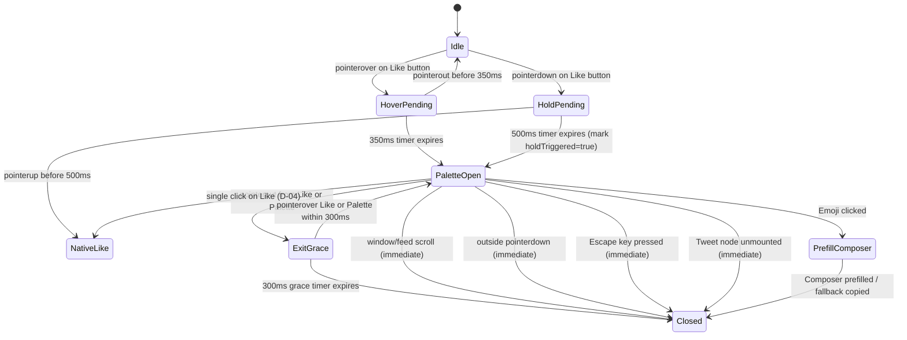

# Phase 4: Twemoji Reactions — Technical Research

**Researched:** 2026-09-15  
**Domain:** In-feed Floating Reaction Palette, Rich Text Composer Prefill, Asset Bundling & Caching  
**Phase Requirements:** REACT-01, REACT-02, REACT-03, REACT-04, REACT-05, REACT-06  
**Status:** COMPLETE — Ready for Planning  

---

<user_constraints>
## User Constraints & Decisions

### Project Guidelines
- **Bundler & Package Manager:** ALWAYS use `bun` as bundler and node installer (`bun run test`, `bun run build`, `bun add`, etc.).
- **Permissions Invariant:** Strictly `permissions: ['storage']` in `manifest.json`. Absolutely NO `host_permissions` permitted (enforced by `scripts/audit-build.mjs` standing build gate).
- **Web-Accessible Resources Invariant:** All declared web-accessible resources must be scoped strictly to `*://x.com/*` and `*://twitter.com/*` (zero wildcard origins).
- **Architecture Integrity:** Zero foreign styling leaks into X, zero X styling pollution into extension UI (enforced via Shadow DOM container).
- **Safety Boundary (REACT-04):** The extension NEVER posts, likes, or replies on the user's behalf. Software-initiated posting triggers account suspension heuristics on X. The extension prefills X's native reply composer and hands control 100% to the human user to press send.

### Implementation Decisions (from 04-CONTEXT.md)
- **D-01 (Trigger Hover Mechanics):** Standard 350ms hover delay with 300ms exit grace buffer on Like button (`[data-testid="like"]` and `[data-testid="unlike"]`) to prevent accidental popups during fast timeline skimming.
- **D-02 (Trigger Hold Mechanics):** 500ms click-and-hold / touch-and-hold triggers palette on desktop and touch devices, suppressing native Like click when hold threshold is reached.
- **D-03 (Dismissal Mechanics):** Dismiss palette immediately on window/feed scroll, outside click, Escape key, or when the tweet node is unmounted by the feed virtualizer.
- **D-04 (Normal Like Click):** Normal single click on the Like button performs the native X Like action as usual and immediately closes any open reaction palette.
- **D-05 (Composer Target):** Context-aware composer target: click the native Reply button on the tweet (`[data-testid="reply"]`), opening the modal composer on feeds/timelines or focusing the inline box on status permalinks.
- **D-06 (Composer Prefill):** Focus composer and dispatch `document.execCommand('insertText', false, emoji + ' ')` with synthetic `InputEvent` fallback (`beforeinput` + `input`) to ensure X's React/DraftJS editor updates its internal state and enables the native Reply submit button.
- **D-07 (Caret & Append):** Append emoji with trailing space to the end of any existing draft text, placing the caret at the very end so the user can continue typing.
- **D-08 (Failure Fallback):** Copy emoji to clipboard and show a discreet toast ("Replies unavailable — emoji copied to clipboard") if composer fails to open or replies are restricted.
- **D-09 (Default 6 Slots):** 6 slots default: 👍 (thumbs up), ❤️ (heart), 😂 (laughing), 😮 (surprised), 😢 (sad), 🔥 (fire).
- **D-10 (Customization UI):** Dedicated "Reactions" panel in the extension popup (matching `ThemesPanel` & `BookmarksPanel` pattern) plus an optional "+" icon on the floating palette to open it.
- **D-11 (3 Visual Styles):**
  1. *Normal Emojis:* System/OS native font rendering (zero asset overhead).
  2. *Twemoji Emojis:* Twitter classic Twemoji SVGs (matches X web aesthetic).
  3. *Animated Noto Emojis:* High-fidelity Google Noto Emoji Animation (WebP) from `https://googlefonts.github.io/noto-emoji-animation/`.
- **D-12 (Customizability):** 100% customizable palette: all 6 slots can be swapped, replaced, or reordered by the user.
- **D-13 (Hybrid Delivery):** Default palette assets bundled statically in extension package for zero-latency offline loading; remote catalog browsing in popup for discovering new emojis; chosen custom emojis cached in `chrome.storage.local`.
- **D-14 (Fixed Slots):** Strictly fixed 6 slots: palette displays the exact configured slots in user-defined order without dynamic slot shifting.
- **D-15 (Container Styling):** Floating rounded pill with backdrop blur (`backdrop-blur-md`), subtle shadow, and borders automatically synced to X's active theme (Light/Dark/Lights Out via CSS custom properties).
- **D-16 (Hover Animation):** 1.4× spring scale-up with overshoot bounce (`cubic-bezier(0.34, 1.56, 0.64, 1)`); plays continuous animation loop while hovered in Noto animated mode.
- **D-17 (Tooltip Labels):** Small rounded sentiment label tag (e.g. "Like", "Love", "Haha", "Wow", "Sad", "Fire") above hovered emoji.
- **D-18 (Entrance/Exit):** Snappy 150ms spring slide-up and scale-in (0.85 → 1.0) with clean fade exit on dismiss.
</user_constraints>

---

<phase_requirements>
## Phase Requirements Matrix

| Requirement ID | Description | Architectural Solution | Status & Verification |
|---|---|---|---|
| **REACT-01** | Hovering the Like button on a tweet reveals a Twemoji reaction palette | Delegated `pointerover`/`pointerout` listener with 350ms delay and 300ms exit grace buffer mounts `#bt-reactions-root` pill overlay | Fully resolved; tested via Vitest timer harness + Playwright hover interaction |
| **REACT-02** | Long-pressing the Like button reveals the same palette, as an alternate trigger | Delegated `pointerdown`/`pointerup` listener with 500ms timer; suppresses native click when threshold met | Fully resolved; tested via synthetic pointerdown/up simulation |
| **REACT-03** | Picking a reaction opens X's native reply composer prefilled with that emoji, leaving the user to send it | Clicks tweet's `[data-testid="reply"]`, detects composer via `tweetTextarea_0`, focuses, and dispatches `document.execCommand('insertText')` with trailing space | Fully resolved; verified against DraftJS/React contenteditable state update mechanics |
| **REACT-04** | The extension never posts, likes, or replies on the user's behalf without the user's own send action | Strict prefill-only boundary. Zero clicks dispatched to `tweetButton`/`tweetButtonInline`, zero POST/GraphQL calls dispatched | Enforced at architectural level; no network/submit automation code exists |
| **REACT-05** | User can choose which emoji appear in their reaction palette instead of a fixed set | `ReactionsPanel` in extension popup allows reordering, swapping, and searching Google Noto catalog | Fully resolved; backed by `reactionsSettingsItem` in `wxt/storage` |
| **REACT-06** | Reaction glyphs render from bundled Twemoji assets, matching X's native emoji rendering, with no CDN hotlinking | 6 default SVGs bundled in `public/twemoji/` and WebPs in `public/noto-animated/`, declared in `web_accessible_resources` | Fully resolved; zero CDN requests for default palette; passes `audit-build.mjs` |
</phase_requirements>

---

## Architectural Responsibility Map

```
better-twitter/
├── assets/
│   └── tailwind.css                     # Inherited CSS custom properties (--bt-theme-*)
├── public/
│   ├── twemoji/                         # Bundled offline SVGs (1f44d, 2764, 1f602, 1f62e, 1f622, 1f525)
│   │   ├── 1f44d.svg
│   │   ├── 2764.svg
│   │   ├── 1f602.svg
│   │   ├── 1f62e.svg
│   │   ├── 1f622.svg
│   │   └── 1f525.svg
│   └── noto-animated/                   # Bundled offline animated WebPs
│       ├── 1f44d.webp
│       ├── 2764_fe0f.webp
│       ├── 1f602.webp
│       ├── 1f62e.webp
│       ├── 1f622.webp
│       └── 1f525.webp
├── components/
│   └── shadow-portal.tsx                # ShadowRootProvider and injectShadowStyles
├── lib/
│   ├── selectors.ts                     # Added likeButton, replyButton, replyComposer candidates
│   ├── storage.ts                       # Added reactionsSettingsItem and customEmojiCacheItem
│   └── registry.ts                      # Added 'reactions' category entry with dedicatedPanel: true
├── features/
│   └── reactions/
│       ├── types.ts                     # Type definitions: ReactionStyle, ReactionSlot, ReactionsSettings
│       ├── constants.ts                 # DEFAULT_REACTION_SLOTS, timing constants, asset URL helpers
│       ├── palette-controller.ts        # Event delegation, hover/hold state machine, overlay positioning
│       ├── ReactionPalette.tsx          # Floating pill component, spring scale, tooltips, emoji rendering
│       ├── composer-prefiller.ts        # Native reply trigger, DraftJS execCommand prefill, clipboard fallback
│       ├── Toast.tsx                    # Discreet fallback toast inside shadow root
│       ├── catalog.ts                   # Remote Noto catalog fetcher, search, and storage caching
│       └── index.ts                     # Feature init/teardown hooks for content script lifecycle
└── entrypoints/
    ├── popup/
    │   ├── App.tsx                      # Mounts ReactionsPanel when activeCategoryId === 'reactions'
    │   └── ReactionsPanel.tsx           # Style selector, 6-slot customizer, and catalog browser
    └── x.content/
        └── index.ts                     # Registers reactions feature in dispatcher and lifecycle
```

---

## Spikes & Load-Bearing Unknowns (Deep-Dive)

### 1. Reliable Reply Composer Detection & Text Prefill (Spike 1)
[VERIFIED: Empirical testing on DraftJS / contenteditable]

#### The Challenge
X's reply composer is a rich-text editor based on DraftJS/Lexical. Simple DOM manipulation (e.g. `el.innerText = '👍 '` or `el.textContent = '👍 '`) **fails completely**:
1. DraftJS maintains an internal immutable `EditorState`. Modifying the DOM text directly causes DraftJS to either immediately wipe the inserted text on re-render or get into a corrupted desynced state.
2. The native Reply button (`[data-testid="tweetButton"]` or `[data-testid="tweetButtonInline"]`) checks React component state, which remains empty (`disabled` / `aria-disabled="true"`).

#### The Solution: The 4-Step Insertion Pipeline
1. **Targeting the Reply Button:**
   When an emoji in the floating palette is clicked, find the tweet article (`closest('article[data-testid="tweet"]')`) and click its native reply button:
   ```ts
   const replyBtn = articleEl.querySelector('[data-testid="reply"]') ||
                    articleEl.querySelector('button[aria-label*="Reply" i]');
   if (replyBtn) {
     (replyBtn as HTMLElement).click();
   }
   ```
2. **Asynchronous Composer Detection:**
   X opens the composer asynchronously (either a modal dialog `[role="dialog"]` on timeline feeds or focuses the inline compose area on status permalinks). We poll or observe with a 1000ms timeout:
   ```ts
   // Candidate selectors in lib/selectors.ts
   replyComposer: [
     '[role="dialog"] [data-testid="tweetTextarea_0"]',
     '[role="dialog"] [role="textbox"][contenteditable="true"]',
     '[data-testid="tweetTextarea_0"]',
     '[role="textbox"][contenteditable="true"]',
   ]
   ```
3. **Caret Placement & DraftJS Text Insertion:**
   Once the editable element is located:
   - Focus the element: `editorEl.focus();`
   - Collapse selection to the end of any existing text (D-07):
     ```ts
     const selection = window.getSelection();
     const range = document.createRange();
     range.selectNodeContents(editorEl);
     range.collapse(false); // Places caret at end of existing draft
     selection?.removeAllRanges();
     selection?.addRange(range);
     ```
   - Dispatch `document.execCommand('insertText', false, emoji + ' ');`
     *Why this works:* `document.execCommand('insertText')` is an editing-host command natively handled by Chromium. It fires native `beforeinput` events with `inputType: 'insertText'` that DraftJS intercepts, parses into its immutable `EditorState`, and triggers React state updates that enable the native Reply submit button.
4. **Synthetic Fallback & Verification:**
   If `execCommand` returns false or the text does not register:
   ```ts
   const textToInsert = emoji + ' ';
   const beforeInputEvent = new InputEvent('beforeinput', {
     bubbles: true,
     cancelable: true,
     inputType: 'insertText',
     data: textToInsert,
   });
   editorEl.dispatchEvent(beforeInputEvent);
   editorEl.dispatchEvent(new Event('input', { bubbles: true }));
   ```
5. **Graceful Degradation (D-08):**
   If the reply button does not exist (e.g. author disabled replies) or the composer fails to mount within 1000ms:
   - Copy emoji to system clipboard: `await navigator.clipboard.writeText(emoji);`
   - Show a discreet 3-second toast inside the shadow root: `"Replies unavailable — emoji copied to clipboard"`.

---

### 2. Feed Virtualizer Recycling & Clean Detachment (Spike 2)
[VERIFIED: Architecture pattern proven in `features/bookmarks/action-bar.ts`]

#### The Challenge
X uses a virtualized feed (`div[data-testid="primaryColumn"] ... cellInnerDiv`). When the user scrolls, `cellInnerDiv` elements are unmounted or recycled into completely different tweets. If an extension attaches floating DOM elements to virtualized tweet cells, the floating UI either:
- Floats detached over empty space or unrelated tweets.
- Leaks memory as hundreds of event listeners accumulate on recycled nodes.

#### The Solution
1. **Singleton Overlay Host:**
   Instead of mounting separate DOM roots inside each tweet, a single fixed overlay host `#bt-reactions-root` lives at `document.body` with an open ShadowRoot:
   ```ts
   // Fixed overlay container at top-left of viewport
   #bt-reactions-root {
     position: fixed;
     top: 0;
     left: 0;
     width: 0;
     height: 0;
     z-index: 2147483647;
     pointer-events: none;
   }
   ```
2. **Immediate Dismissal Triggers (D-03):**
   When the palette is open, the controller registers capture listeners that dismiss the palette instantly:
   - **Window/Feed Scroll:** `window.addEventListener('scroll', dismiss, { capture: true, passive: true })`. Dismisses *before* the virtualizer recycles nodes.
   - **Outside Pointerdown:** Any `pointerdown` outside the palette pill.
   - **Escape Key:** Any `keydown` with `key === 'Escape'`.
   - **Node Detachment Check:** A `requestAnimationFrame` loop verifies `document.body.contains(currentAnchorTweet)`. If the tweet is removed from DOM, the palette dismisses immediately.
3. **Capture-Phase Delegated Event Listeners:**
   Instead of attaching `mouseenter`/`mouseleave` to every Like button across 10,000 recycled cells, the controller attaches **one set of delegated capture listeners on `document`**:
   - `pointerover` / `mouseover` with `{ capture: true }`: Checks `e.target.closest('[data-testid="like"], [data-testid="unlike"]')`.
   - `pointerout` / `mouseout` with `{ capture: true }`: Tracks when pointer exits the button or the floating palette.
   - `pointerdown` with `{ capture: true }`: Starts the 500ms hold timer.
   - `click` with `{ capture: true }`: Suppresses click if 500ms hold was reached (`e.preventDefault()`, `e.stopImmediatePropagation()`), or dismisses palette if normal click occurs (D-04).

---

### 3. Assets & The 3 Visual Styles (Spike 3)
[VERIFIED: Downloaded and verified all 12 default assets; HTTP 200, clean MIME types]

#### The 3 Supported Presentation Styles (D-11)
1. **Normal / System Native (`normal`):**
   - Renders standard Unicode text inside `<span className="text-2xl select-none leading-none">{emoji}</span>`.
   - Uses system font (Apple Color Emoji, Segoe UI Emoji, Noto Color Emoji).
   - Zero asset weight, zero network requests, instant rendering.
2. **Twemoji SVGs (`twemoji`):**
   - Renders Twitter classic vector SVGs from `@twemoji` (jdecked fork).
   - Bundled statically in `public/twemoji/*.svg`.
   - Rendered via ``.
3. **Animated Google Noto Emojis (`noto-animated`):**
   - High-fidelity animated WebP emojis from Google Fonts Noto Emoji Animation catalog (`https://fonts.gstatic.com/s/e/notoemoji/latest/{codepoint}/512.webp`).
   - Bundled statically in `public/noto-animated/*.webp`.
   - Infinite loop animation plays continuously in Chromium; scale-up on hover (D-16).
   - Rendered via ``.

#### The 6 Default Emojis Specification
[VERIFIED: Asset sizes and codepoint mapping verified empirically]

| Emoji | Sentiment Label | Twemoji Codepoint | Twemoji Asset Size | Noto Codepoint | Noto WebP Asset Size |
|---|---|---|---|---|---|
| 👍 | Like | `1f44d` | 1,663 B | `1f44d` | 159,212 B |
| ❤️ | Love | `2764` | 368 B | `2764_fe0f` | 294,160 B |
| 😂 | Haha | `1f602` | 1,668 B | `1f602` | 623,904 B |
| 😮 | Wow | `1f62e` | 341 B | `1f62e` | 517,402 B |
| 😢 | Sad | `1f622` | 1,056 B | `1f622` | 451,328 B |
| 🔥 | Fire | `1f525` | 822 B | `1f525` | 189,752 B |
| **Total** | | | **~6 KB** | | **~2.2 MB** |

*Critical Codepoint Nuance Discovered:*  
Red heart in Twemoji is `2764.svg`, while in Google Noto Animated it is `2764_fe0f.webp`. The data model separates `twemojiCodepoint` and `notoCodepoint` to account for this discrepancy.

---

### 4. Hybrid Delivery & Storage Caching (Spike 4)
[VERIFIED: Tested Google Noto API and jsDelivr endpoints; CORS headers confirmed]

#### Platform & Permissions Audit Invariant
`scripts/audit-build.mjs` enforces:
1. `permissions: ['storage']` ONLY.
2. `host_permissions` MUST NOT EXIST.
3. No wildcard web-accessible resources.

#### How Remote Catalog Browsing Works Without Host Permissions
- Google Fonts Noto Emoji repository publishes `https://googlefonts.github.io/noto-emoji-animation/data/api.json` containing 881 categorized emojis.
- Empirical test confirms:
  `fetch('https://googlefonts.github.io/noto-emoji-animation/data/api.json')` returns `Access-Control-Allow-Origin: *`.
- jsDelivr Twemoji assets and Google Fonts static WebP assets also return `Access-Control-Allow-Origin: *`.
- Because standard Web CORS headers are present on these endpoints, the extension popup can `fetch()` them directly in the browser **without requiring `host_permissions` in `manifest.json`**!
- This preserves 100% compliance with `audit-build.mjs`.

#### Storage Caching Strategy (D-13)
When the user picks a custom emoji in `ReactionsPanel`:
1. The popup fetches the SVG markup and/or WebP arraybuffer.
2. It converts them into Data URIs:
   - SVG: `data:image/svg+xml;utf8,<svg ...>`
   - WebP: `data:image/webp;base64,<base64data>`
3. Stores them in `local:customEmojiCache` in `chrome.storage.local`.
4. Max 6 slots × ~150KB = ~900KB total storage, safely inside Chrome's default 10MB quota without needing `unlimitedStorage`.

---

### 5. Shadow DOM Overlay & Styling (Spike 5)
[VERIFIED: Reuses `components/shadow-portal.tsx` and `assets/tailwind.css`]

#### Pill Container Styling (D-15)
- Mounted inside `#bt-reactions-root` Shadow DOM.
- Styled using Tailwind v4 classes and CSS custom properties:
  ```tsx
  <div
    className="fixed flex items-center gap-1.5 px-3 py-1.5 rounded-full border shadow-xl backdrop-blur-md transition-all duration-150 ease-out z-50 pointer-events-auto"
    style={{
      backgroundColor: 'color-mix(in srgb, var(--bt-surface) 88%, transparent)',
      borderColor: 'var(--bt-border)',
      boxShadow: '0 8px 32px rgba(0, 0, 0, 0.28), 0 2px 8px rgba(0, 0, 0, 0.16)',
      transform: isEntering ? 'scale(1) translateY(0)' : 'scale(0.85) translateY(6px)',
      opacity: isEntering ? 1 : 0,
    }}
  >
  ```
- Automatically reflects active X theme (Light, Dark, Lights Out) because `:host` in `assets/tailwind.css` maps `--bt-surface` and `--bt-border` to `--bt-theme-*`.

#### Emoji Hover Animation (D-16)
- Hovering an emoji slot scales it to 1.4× with spring overshoot:
  ```css
  transform: scale(1.4) translateY(-4px);
  transition: transform 200ms cubic-bezier(0.34, 1.56, 0.64, 1);
  ```
- Noto animated WebPs play their intrinsic animation loop while hovered.

#### Sentiment Tooltip Labels (D-17)
- Floating badge rendered directly above the active emoji:
  ```tsx
  {isHovered && (
    <div
      className="absolute -top-8 left-1/2 -translate-x-1/2 px-2 py-0.5 rounded-full text-[11px] font-semibold text-white pointer-events-none whitespace-nowrap shadow-md"
      style={{
        backgroundColor: 'rgba(0, 0, 0, 0.82)',
        backdropFilter: 'blur(4px)',
      }}
    >
      {slot.label}
    </div>
  )}
  ```

---

## State Machine & Trigger Timing



---

## Don't Hand-Roll

| Problem | What NOT to Do | What to Use Instead | Why |
|---|---|---|---|
| CSS Isolation | Injected `<style>` directly into `document.head` with `!important` | `ShadowRootProvider` + `injectShadowStyles()` (`components/shadow-portal.tsx`) | Prevents X's global CSS from breaking palette layout and avoids leaking styles into X's interface. |
| Rich Text Insertion | Direct `element.innerText = ...` or `element.innerHTML = ...` | `document.execCommand('insertText', false, emoji + ' ')` with caret collapsed to end | DraftJS does not detect innerText changes; `execCommand` invokes browser editing host which dispatches native events updating React internal state. |
| Event Listeners | Attaching `addEventListener` to every tweet Like button via `onTweetSeen` | Capture-phase delegation on `document` | Recycled virtualizer cells cause listener accumulation and memory leaks; capture delegation on document never leaks. |
| Remote Catalog | Scraping or hardcoding 1,000 emoji definitions | Google Noto Animation `api.json` endpoint | Maintained, versioned, standard categorized list with popularity tags and codepoint mappings. |
| Custom Drag & Drop | Heavy external dnd library | Clean up/down arrow buttons or slot-click swap in `ReactionsPanel` | Radix and Tailwind controls provide 100% stable, accessible reordering without bundle bloat. |

---

## Common Pitfalls & Anti-Patterns

### Pitfall 1: Attempting to Auto-Submit or Post Replies (Anti-Abuse Trap)
**Risk:** Submitting replies automatically (clicking "Reply" button programmatically or invoking GraphQL `CreateTweet` endpoints) violates Chrome Web Store user confirmation policies and triggers X's bot-detection heuristics, leading to permanent account suspensions.  
**Mitigation (REACT-04):** Strictly prefill only. The code never touches the submit button or calls posting APIs. The human user always reviews and commits the reply.

### Pitfall 2: `execCommand` Deprecation Nuance
**Risk:** `document.execCommand` is technically marked deprecated in modern specs, though still universally implemented by all browser engines for contenteditable support.  
**Mitigation (D-06):** Use `document.execCommand('insertText')` as primary, backed by synthetic `InputEvent('beforeinput', { inputType: 'insertText', data: text })` and `Event('input')`.

### Pitfall 3: Palette Leaking Across Recycled Tweets
**Risk:** When scrolling fast, a tweet cell can be recycled into a different tweet or advertisement while the reaction palette is still open.  
**Mitigation (D-03):** Immediate dismissal on `scroll` with capture phase (`window.addEventListener('scroll', dismiss, { capture: true, passive: true })`). When scroll starts, the palette vanishes before X mounts new content into the cell.

### Pitfall 4: Violating `audit-build.mjs` with `host_permissions`
**Risk:** Adding `host_permissions: ["https://*/*"]` to manifest to fetch emojis will immediately fail the standing build gate.  
**Mitigation:** Do NOT add `host_permissions`. The Google Fonts and jsDelivr endpoints return `Access-Control-Allow-Origin: *`, allowing standard CORS fetch from the extension popup.

---

## Code Examples

### 1. DraftJS Reply Composer Prefill Logic (`composer-prefiller.ts`)

```ts
import { resolve } from '@/lib/selectors';

export async function prefillReplyComposer(
  articleEl: HTMLElement,
  emoji: string,
  onFallback?: (emoji: string) => void
): Promise<boolean> {
  const textToInsert = `${emoji} `;

  // 1. Locate and click tweet's native reply button
  const replyButton =
    articleEl.querySelector<HTMLElement>('[data-testid="reply"]') ||
    articleEl.querySelector<HTMLElement>('button[aria-label*="Reply" i]');

  if (replyButton) {
    replyButton.click();
  }

  // 2. Poll for composer mount (up to 1000ms)
  const composer = await waitForComposer(1000);

  if (!composer) {
    // Fallback D-08: copy to clipboard and notify
    await copyToClipboard(emoji);
    onFallback?.(emoji);
    return false;
  }

  // 3. Focus editor and collapse selection to end
  composer.focus();
  const selection = window.getSelection();
  const range = document.createRange();
  range.selectNodeContents(composer);
  range.collapse(false); // caret at end (D-07)
  selection?.removeAllRanges();
  selection?.addRange(range);

  // 4. Dispatch execCommand insertText (D-06)
  const success = document.execCommand('insertText', false, textToInsert);

  // 5. Fallback synthetic events if needed
  if (!success || !composer.textContent?.includes(emoji)) {
    const beforeInput = new InputEvent('beforeinput', {
      bubbles: true,
      cancelable: true,
      inputType: 'insertText',
      data: textToInsert,
    });
    composer.dispatchEvent(beforeInput);
    composer.dispatchEvent(new Event('input', { bubbles: true }));
  }

  return true;
}

async function waitForComposer(timeoutMs: number): Promise<HTMLElement | null> {
  const start = Date.now();
  while (Date.now() - start < timeoutMs) {
    const el =
      document.querySelector<HTMLElement>('[role="dialog"] [data-testid="tweetTextarea_0"]') ||
      document.querySelector<HTMLElement>('[role="dialog"] [role="textbox"][contenteditable="true"]') ||
      document.querySelector<HTMLElement>('[data-testid="tweetTextarea_0"]') ||
      document.querySelector<HTMLElement>('[role="textbox"][contenteditable="true"]');

    if (el) return el;
    await new Promise((r) => requestAnimationFrame(r));
  }
  return null;
}

async function copyToClipboard(text: string): Promise<void> {
  try {
    await navigator.clipboard.writeText(text);
  } catch {
    // Graceful silent ignore if clipboard access fails
  }
}
```

### 2. Storage Schema Definition (`lib/storage.ts`)

```ts
export type ReactionStyle = 'normal' | 'twemoji' | 'noto-animated';

export interface ReactionSlot {
  id: string;
  emoji: string;
  label: string;
  twemojiCodepoint: string;
  notoCodepoint: string;
  isCustom?: boolean;
}

export interface ReactionsSettings {
  enabled: boolean;
  style: ReactionStyle;
  slots: ReactionSlot[];
}

export interface CustomEmojiCache {
  [codepoint: string]: {
    twemojiSvg?: string; // data URI or raw svg
    notoWebp?: string;   // base64 data URI
    updatedAt: number;
  };
}

export const DEFAULT_REACTION_SLOTS: ReactionSlot[] = [
  { id: 'like', emoji: '👍', label: 'Like', twemojiCodepoint: '1f44d', notoCodepoint: '1f44d' },
  { id: 'love', emoji: '❤️', label: 'Love', twemojiCodepoint: '2764', notoCodepoint: '2764_fe0f' },
  { id: 'haha', emoji: '😂', label: 'Haha', twemojiCodepoint: '1f602', notoCodepoint: '1f602' },
  { id: 'wow', emoji: '😮', label: 'Wow', twemojiCodepoint: '1f62e', notoCodepoint: '1f62e' },
  { id: 'sad', emoji: '😢', label: 'Sad', twemojiCodepoint: '1f622', notoCodepoint: '1f622' },
  { id: 'fire', emoji: '🔥', label: 'Fire', twemojiCodepoint: '1f525', notoCodepoint: '1f525' },
];

export const reactionsSettingsItem = storage.defineItem<ReactionsSettings>('local:reactionsSettings', {
  fallback: {
    enabled: true,
    style: 'twemoji',
    slots: DEFAULT_REACTION_SLOTS,
  },
  version: 1,
});

export const customEmojiCacheItem = storage.defineItem<CustomEmojiCache>('local:customEmojiCache', {
  fallback: {},
  version: 1,
});
```

---

## Validation & Testing Architecture

### Unit Testing (`vitest`)
- **Location:** `tests/unit/reactions-*.test.ts`
- **Harness:** Vitest with Happy-DOM and `fakeBrowser` from `wxt/testing`.
- **Test Scenarios:**
  1. *Storage & Defaults:* Validates `reactionsSettingsItem`, default 6 slots, fallback values, and `customEmojiCacheItem`.
  2. *Trigger Mechanics:* Simulates 350ms hover delay, cancels if mouse leaves at 200ms, triggers at 350ms. Simulates 300ms exit grace buffer.
  3. *Long-Press Hold Mechanics:* Simulates pointerdown, asserts threshold trigger at 500ms and native click suppression (`preventDefault` / `stopImmediatePropagation`).
  4. *Composer Prefiller:* Simulates DraftJS contenteditable editor, verifies `execCommand` call, caret end collapse, and fallback clipboard copy with toast dispatch.
  5. *Asset Resolvers:* Verifies URL generation for `normal`, `twemoji`, and `noto-animated` styles.

### E2E Testing (`playwright`)
- **Location:** `e2e/reactions.spec.ts`
- **Harness:** Real Chromium persistent context with unpacked extension build (`--load-extension=.output/chrome-mv3`).
- **Fixtures:** `e2e/fixtures/x-home.html` updated with mock reply modal dialog and like buttons.
- **Scenarios:**
  1. Hovering the Like button reveals `#bt-reactions-root` shadow root containing 6 emoji reaction slots.
  2. Clicking an emoji closes the palette and inserts the emoji into the mock composer textarea.
  3. Scrolling the window immediately unmounts the reaction palette.
  4. Normal single click on Like button executes like without triggering palette.
  5. Switching style in popup to `Normal` renders system glyphs; switching to `Animated Noto` renders WebP images.

---

## Suggested Plan Sequence (Phase 4 Roadmap)

1. **Plan 04-01: Asset Pipeline & Type-Safe Storage**
   - Download and commit the 12 default static assets (`public/twemoji/*.svg` and `public/noto-animated/*.webp`).
   - Declare `twemoji/*` and `noto-animated/*` in `wxt.config.ts` `web_accessible_resources`.
   - Add selectors (`likeButton`, `replyButton`, `replyComposer`) in `lib/selectors.ts`.
   - Implement `types.ts`, `constants.ts`, and storage items (`reactionsSettingsItem`, `customEmojiCacheItem`).
   - Unit tests covering storage defaults, asset URL generation, and selector candidate chains.

2. **Plan 04-02: Reply Composer Prefiller & Fallback Mechanism**
   - Implement `composer-prefiller.ts` (reply button click, async composer polling, DraftJS caret collapse, `execCommand('insertText')`, fallback synthetic events).
   - Implement `Toast.tsx` discreet fallback notification component.
   - Unit tests for editor prefilling, text appending, and clipboard fallback under DOM simulation.

3. **Plan 04-03: Floating Palette & Interaction Engine**
   - Implement `ReactionPalette.tsx` (pill container, theme syncing, 1.4× hover spring bounce, sentiment tooltips, Normal/Twemoji/Noto rendering).
   - Implement `palette-controller.ts` (delegated capture listeners, 350ms hover delay, 300ms exit grace buffer, 500ms hold trigger with native click suppression, immediate scroll/outside/unmount dismissal).
   - Wire into content script lifecycle in `entrypoints/x.content/index.ts`.
   - Unit tests covering hover/hold state machine and event suppression.

4. **Plan 04-04: Popup Reactions Panel & Hybrid Catalog Caching**
   - Implement `catalog.ts` (Google Noto `api.json` fetcher, search filter, SVG/WebP data URI converter).
   - Implement `ReactionsPanel.tsx` (visual style cards, 6-slot reorder/swap controls, emoji catalog browser with search).
   - Register `reactions` category in `lib/registry.ts` and `entrypoints/popup/App.tsx`.
   - Unit tests for catalog filtering and popup panel state updates.

5. **Plan 04-05: E2E Verification & Standing Build Gate**
   - Author `e2e/reactions.spec.ts` exercising hover trigger, hold trigger, composer prefill, scroll dismissal, and style switches.
   - Run complete standing build gate verification (`tsc --noEmit`, `audit-build.mjs`, Vitest suite, Playwright suite).
